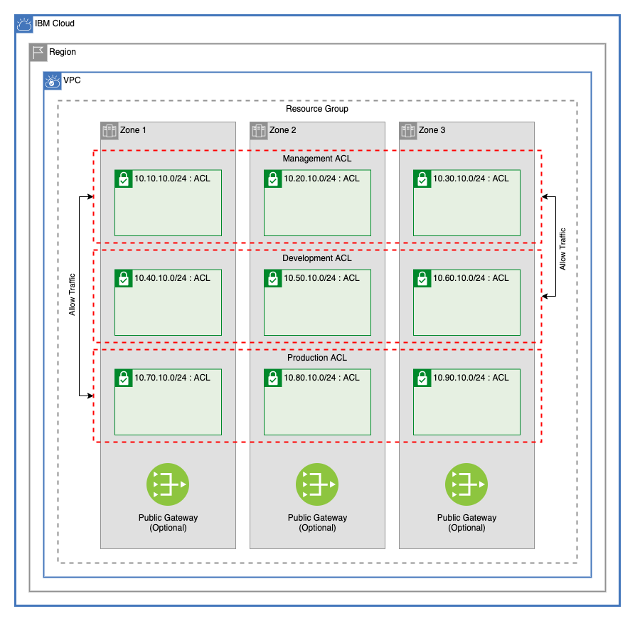

# Easy Multitier VPC

This template allows users to easily create a VPC with three tiers, each tier having one subnet in each of three zones with very few inputs needed by the user to quikly start testing on IBM Cloud. 

## Default Configuration

The defaults of this module can be [overridden](#overriding-variables) with JSON to allow for a fully cusomizable VPC environment.

## Table of Contents

1. [Module Variables](#module-variables)
1. [VPC and Subnets](#vpc-and-subnets)
2. [Network ACL](#nettwork-access-control-list)
3. [Public Gateways](#public-gateways)
4. [Overriding Variables](#overriding-variables)

## Module Variables

Name                    | Type         | Description                                                                                                                               | Sensitive | Default
----------------------- | ------------ | ----------------------------------------------------------------------------------------------------------------------------------------- | --------- | -------------------------------------------
ibmcloud_api_key        | string       | The IBM Cloud platform API key needed to deploy IAM enabled resources.                                                                    | true      | 
prefix                  | string       | A unique identifier for resources. Must begin with a letter. This prefix will be prepended to any resources provisioned by this template. |           | `ez-multizone`
region                  | string       | Region where VPC will be created. To find your VPC region, use `ibmcloud is regions` command to find available regions.                   |           | `us-south`
resource_group          | string       | Name of existing resource group where all infrastructure will be provisioned                                                              |           | `asset-development`
tags                    | list(string) | List of tags to apply to resources created by this module.                                                                                |           | `["ez-vpc", "transit-gateway-vpc"]`
tier_names              | list(string) | Name of each tier in the VPC. Each tier will be created with one subnet in each zone.                                                     |           | `["management", "workload"]`
use_public_gateways     | list(string) | List of subnet tiers to attach public gateways. A public gateway will be created in each zone if any VPC is in this list.                 |           | `["workload"]`
allow_inbound_traffic   | list(string) | Create a rule in each tier in this list to allow all inbound traffic.                                                                     |           | `[]`
add_cluster_rules       | list(string) | Create a rule in each tier in this list to allow rules to allow the creation of IBM managed clusters.                                     |           | `["workload"]`
classic_access          | bool         | Add the ability to access classic infrastructure from your VPC.                                                                           |           | `false`
override_json           | string       | Override any values with JSON to create a completely custom network. All quotation marks must be correctly escaped.                       |           | `"{}"`

---

## VPC and Subnets

### VPC

This module creates a single VPC in one IBM Cloud Region. The VPC can optionally be given access to Classic Infrastructure resources using the `classic_access` variable.

### Subnets

This module creates three tiers of subnets, each with one subnet in each of three zones.

#### Management Tier

Zone | Subnet CIDR
-----|-------------
1    | 10.10.10.0/24
2    | 10.20.10.0/24
3    | 10.30.10.0/24

#### Workload Tier

Zone | Subnet CIDR
-----|-------------
1    | 10.40.10.0/24
2    | 10.50.10.0/24
3    | 10.60.10.0/24

---

## Network Access Control List

A single network ACL is created for each VPC tier. Dynamic rules are created to allow all traffic from within a single ACL.

### Management Network Access Control Rules

The following network rules are automatically created to allow the management subnet tier to communicate within the tier and with the development and production tiers.

Source        | Destination   | Direction  | Allow / Deny
--------------|---------------|------------|--------------
10.10.10.0/24 | Any           | Inbound    | Allow
10.20.10.0/24 | Any           | Inbound    | Allow
10.30.10.0/24 | Any           | Inbound    | Allow
10.40.10.0/24 | Any           | Inbound    | Allow
10.50.10.0/24 | Any           | Inbound    | Allow
10.60.10.0/24 | Any           | Inbound    | Allow
Any           | 10.10.10.0/24 | Outbound   | Allow
Any           | 10.20.10.0/24 | Outbound   | Allow
Any           | 10.30.10.0/24 | Outbound   | Allow
Any           | 10.40.10.0/24 | Outbound   | Allow
Any           | 10.50.10.0/24 | Outbound   | Allow
Any           | 10.60.10.0/24 | Outbound   | Allow
Any           | Any           | Outbound   | Allow

### Development Network Access Control Rules

The following rules are created to allow the Development network to communicate to communicate within the tier and with the management tier.

Source        | Destination   | Direction  | Allow / Deny
--------------|---------------|------------|--------------
10.10.10.0/24 | Any           | Inbound    | Allow
10.20.10.0/24 | Any           | Inbound    | Allow
10.30.10.0/24 | Any           | Inbound    | Allow
10.40.10.0/24 | Any           | Inbound    | Allow
10.50.10.0/24 | Any           | Inbound    | Allow
10.60.10.0/24 | Any           | Inbound    | Allow
Any           | 10.10.10.0/24 | Outbound   | Allow
Any           | 10.20.10.0/24 | Outbound   | Allow
Any           | 10.30.10.0/24 | Outbound   | Allow
Any           | 10.40.10.0/24 | Outbound   | Allow
Any           | 10.50.10.0/24 | Outbound   | Allow
Any           | 10.60.10.0/24 | Outbound   | Allow
Any           | Any           | Outbound   | Allow

### Additional Access Control Rules

- To dynamically create allow rules to allow IBM Managed Clusters, add a tier's name to the  `add_cluster_rules` variable list.
- To create a rule to allow all inbound traffic to your VPC,  add a tier's name to the  `allow_inbound_traffic` variable list. 

---

## Public Gateways

Optionally, a public gateway can be added to each of the three subnets by adding a tier's name to the  `use_public_gateways` variable list. If the list is empty, no public gateways will be provisioned.

---

## Overriding Variables

This template uses a [vpc module](./ez_vpc/vpc) to create the network architecture. A complete custom network architecture can be created from this template by passing stringified `json` data into the `override_json` variable. For an example of a valid JSON file, see [override-json.json](./override-json.json). 

For more information about configuring the module see the [vpc module](./ez_vpc/vpc) for a detailed README and a full list of accepted variables.